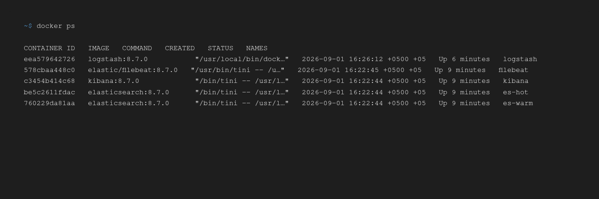
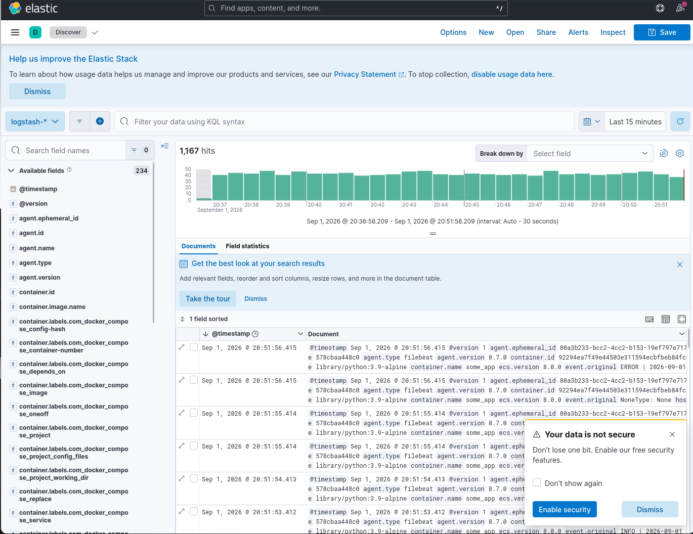

# Домашнее задание 15 - Elastic Stack (ELK)

## Что делал

Развернул стек в docker compose: два встроенных в Elasticsearch «сервера» hot/warm, logstash, kibana и filebeat. Ниже - как это устроено и что в итоге работает.

## Задание 1. Стек в докере

Поднял и связал между собой:

- **elasticsearch** - 2 ноды (hot и warm) в одном кластере `es-docker-cluster`;
- **logstash** - принимает события от filebeat и пишет их в elasticsearch;
- **kibana** - UI для просмотра логов;
- **filebeat** - собирает логи всех docker-контейнеров системы и шлёт их в logstash.

> Нода `es-hot` слушает `9200` наружу, `es-warm` доступен только внутри сети `elastic`. Порт `5046` на logstash - приём от filebeat, `5601` на kibana - веб-интерфейс. Требование «приёма по tcp json-сообщений» выполнено: filebeat отдаёт события в logstash по tcp (протокол beats), а logstash дополнительно разбирает json в поле `message`.

### Состояние через 5 минут после старта

Контейнеров ровно 5, все `Up`, без перезапусков:



### Манифест и конфигурации

| Файл | Зачем |
|---|---|
| `docker-compose.yml` | описание всего стека |
| `configs/logstash.conf` | pipeline: input beats → json-filter → output elasticsearch |
| `configs/logstash.yml` | минимальный конфиг logstash |
| `configs/filebeat.yml` | сбор docker-логов и отправка в logstash |

Как поднимается:

```bash
docker compose up -d
```

Пара практических замечаний, которые пригодились:

- `node.roles` задан явно: `es-hot` = `master,data_content,data_hot`, `es-warm` = `master,data_warm` - без этого обе ноды ведут себя одинаково и архитектура hot/warm не имеет смысла.
- `xpack.security.enabled=false` - чтобы не тянуть сертификаты, логи не секретные, а задача про маршрутизацию.
- `ulimits` + `vm.max_map_count` - без этого elasticsearch падает со своей «любимой» ошибкой про memory-mapped файлы.
- logstash в `docker-compose.yml` первоначально давал `OutOfMemoryError` на 256 Mb heap - поднял до 512 Mb.

## Задание 2. Index patterns и Discover

В Kibana создал index-pattern по реально существующему индексу `logstash-*` (поле времени - `@timestamp`):


В Discover посмотрел, как логи попадают в elasticsearch, искал по полям и по сообщению. Стуктура события удобная: filebeat докидывает `container.name`, `container.image`, `stream`, а logstash отдельно раскладывает json-часть события:



Для проверки «прогонки» логов до elasticsearch запустил тестовое приложение (`pinger/run.py`) - оно раз в секунду пишет в stdout случайный лог (info/warning/error/exception). Его логи из docker забирает filebeat, отправляет в logstash, и они появляются в индексе `logstash-YYYY.MM.DD`:

```bash
docker run -d --name some_app --network elk_elastic \
  -v $(pwd)/pinger/run.py:/opt/run.py \
  library/python:3.9-alpine python3 /opt/run.py
```

Проверка, что логи на месте (индекс `logstash-2026.09.01`, документов от `some_app` - тысячи):

```bash
curl -s 'localhost:9200/logstash-2026.09.01/_search?q=container.name:some_app&size=1'
```

Стек в `docker-compose.yml` - 5 сервисов (без `some_app`, чтобы не засорять скриншот `docker ps`, но это не обязательно, можно добавить его как 6-й сервис).

## Итог

- ✅ elasticsearch hot+warm, logstash, kibana, filebeat - 5 контейнеров живут;
- ✅ filebeat собирает docker-логи, logstash принимает их по tcp и складывает в `logstash-*`;
- ✅ index-pattern создан, в Discover логи видны и ищутся;
- ✅ логи тестового приложения доезжают до elasticsearch.